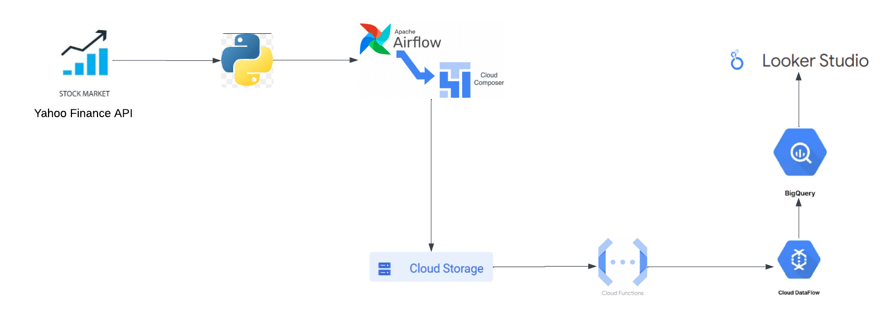

# Stock_Market_ETL
This is a Stock market analysis project that fetches prices for each stock in VUG index from rapodapi.com and performs basic to advanced analytics with the data collected.

Tech Stack-
Python
GCP 
Looker 

This is the architecture diagram - 
